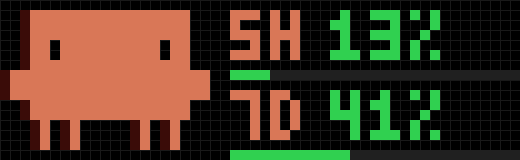
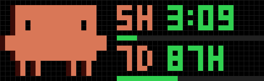

# Claude Usage for AWTRIX NG (Ulanzi TC002)

Unofficial. Shows your Claude plan limits on a 52×16 AWTRIX NG clock: the rolling
**5-hour** and **weekly** window, with the Claude mascot getting nervous as you approach a
limit. Every 4 seconds the values alternate with the time until the window resets.

| Usage | Time until reset |
|---|---|
|  |  |

Two parts:

| Part | Runs on | File |
|---|---|---|
| AWTRIX script “Claude Usage” | the clock | `claude-usage.ax` (AWTRIX Hub) |
| Status line sender | your computer, inside Claude Code | `claude_usage_mqtt.py` |
| Done / waiting hook (optional) | your computer, inside Claude Code | `claude_event_mqtt.py` |

The clock never talks to Anthropic. Claude Code already hands the limits to its status
line command; the sender publishes them as a retained MQTT message, the script subscribes.
No API key, no extra requests.

## Requirements

- Claude Code with a claude.ai subscription. Claude Code documents the `rate_limits`
  status line field for **Pro and Max**; it also works with a **Team** plan (tested), but
  that is not documented and may change. The limits are only present after the first
  response of a session, and only while Claude Code runs somewhere.
- An MQTT broker that both your computer and the clock can reach; MQTT set up on the clock
  (System → MQTT).
- `mosquitto_pub` on the computer (`brew install mosquitto`, `apt install mosquitto-clients`).

## 1. The sender

```bash
cp claude_usage_mqtt.py ~/.claude/ && chmod +x ~/.claude/claude_usage_mqtt.py
cat > ~/.config/claude-usage-mqtt.env <<'EOF'
MQTT_HOST=192.168.1.10
MQTT_PORT=1883
MQTT_USER=
MQTT_PASS=
STATE_TOPIC=claude-code/usage
# 1 = also create Home Assistant sensors via MQTT discovery
HA_DISCOVERY=0
EOF
chmod 600 ~/.config/claude-usage-mqtt.env
```

`~/.claude/settings.json`:

```json
"statusLine": { "type": "command", "command": "~/.claude/claude_usage_mqtt.py" }
```

The status line then reads `[Opus] 5h: 13% | 7d: 41%`. Check the broker:
`mosquitto_sub -h <broker> -t claude-code/usage -v`.

macOS: if publishing fails with “No route to host” for a broker in your own subnet, allow
your terminal under *System Settings → Privacy & Security → Local Network*.

## 2. The script

Install “Claude Usage” from the [AWTRIX Hub](https://awtrix.de) (the four mascot icons come along), or paste
`claude-usage.ax` in the web UI under Scripts. Settings:

| Setting | Default | |
|---|---|---|
| MQTT topic | `claude-code/usage` | must match `STATE_TOPIC` |
| Warning from | 70 % | orange, worried mascot |
| Alert from | 90 % | red, alarmed mascot (100 %: knocked out) |
| Old after | 30 min | dark red frame when nothing arrived |
| Show reset time | on | `3:11` below a day, `87H` above |
| Hide without data | on | skip the app until the first message |
| Notifications | on | mascot + “CLAUDE 5H 92%” when a window crosses the warning or alert level or reaches 100 % (once per crossing) |
| Notification sound | off | built-in melodies, or the name of a melody stored on the clock |
| Quiet from / until | 22 / 7 | no sound in these hours |

## 3. Optional: “done” and “waiting” on the clock

A Claude Code hook tells the clock when Claude finished a longer task or waits for your
input (a permission or a question), so you can look away during long runs.

| Done | Waiting |
|---|---|
| mascot + “DONE” + project, green | mascot + “WAITING” + project, orange |

```bash
cp claude_event_mqtt.py ~/.claude/ && chmod +x ~/.claude/claude_event_mqtt.py
```

Add to `~/.claude/settings.json` (same env file as the sender; optional keys
`EVENT_TOPIC=claude-code/event`, `MIN_SECONDS=60`):

```json
"hooks": {
  "UserPromptSubmit": [{"hooks": [{"type": "command", "command": "~/.claude/claude_event_mqtt.py", "async": true}]}],
  "Stop":             [{"hooks": [{"type": "command", "command": "~/.claude/claude_event_mqtt.py", "async": true}]}],
  "Notification":     [{"hooks": [{"type": "command", "command": "~/.claude/claude_event_mqtt.py", "async": true}]}]
}
```

“Done” is only sent when the turn took at least `MIN_SECONDS`, so quick answers stay quiet.
Subagents are ignored. Messages are not retained; the script drops anything older than two
minutes. Settings on the clock: *Done / waiting*, *Event topic*, *Done text*, *Waiting text*
(up to 8 characters, e.g. in your language), *Done melody*, *Waiting melody* (sound and quiet
hours as above).

## Payload

```json
{"five_hour_pct": 13.0, "five_hour_resets_at": 1791453000,
 "seven_day_pct": 41.0, "seven_day_resets_at": 1791756000, "updated_at": 1791441318}
```

Percentages 0–100 or `null` when a window is not active; times in Unix seconds. Anything
that publishes this shape works, the sender is just one way.

## Credits and license

Mascot icons: the “Claude Usage” icon set by another author on the AWTRIX Hub, installed
from the Hub via `@icons`. This project is unofficial and not affiliated with or endorsed by
Anthropic; “Claude” is a trademark of Anthropic.

Script and sender: MIT License, see [LICENSE](LICENSE).
